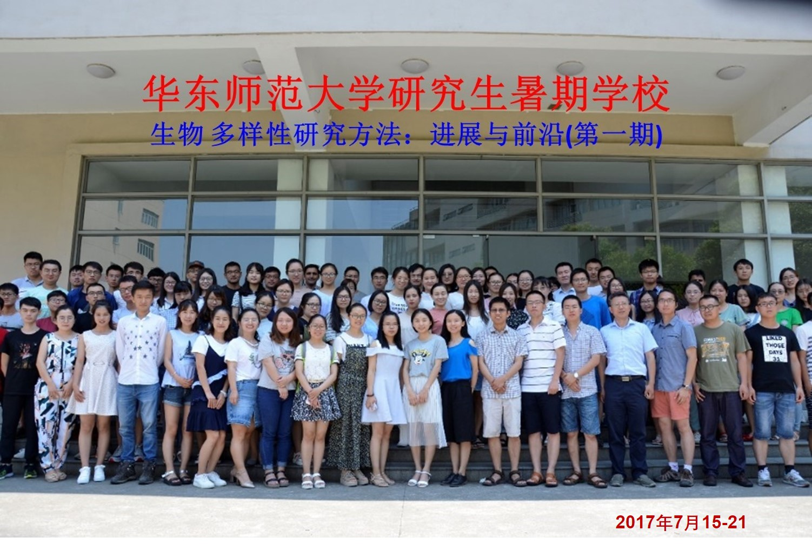
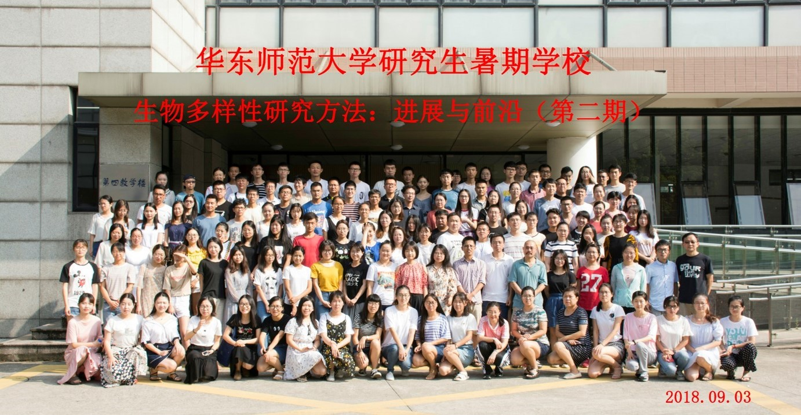
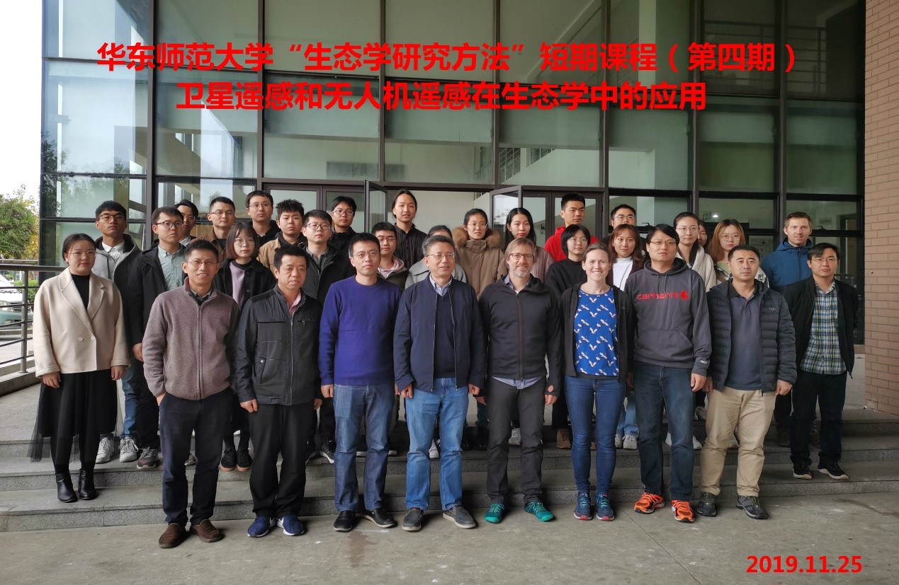
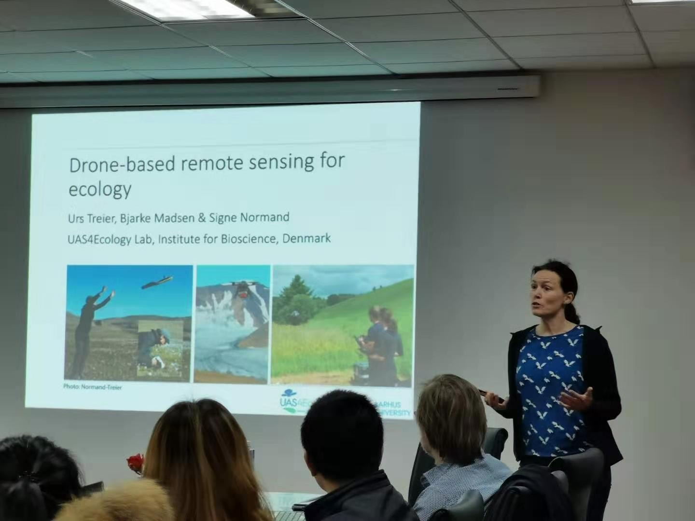
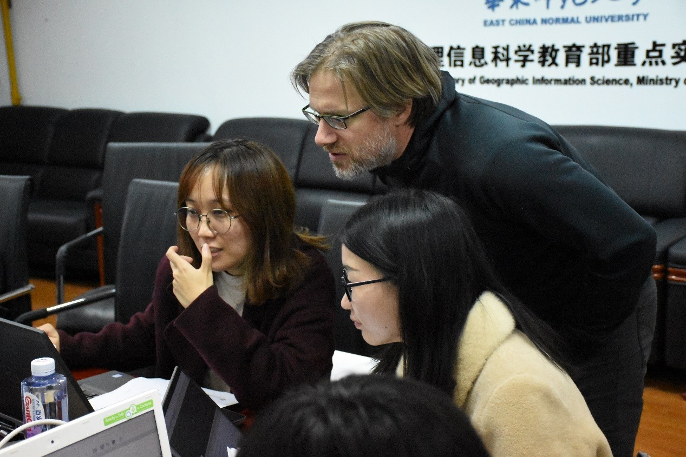
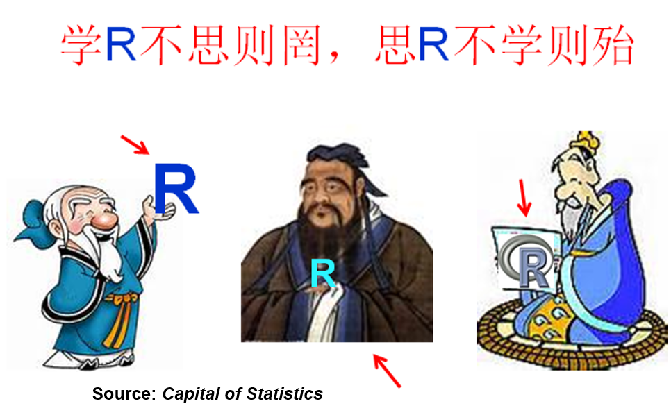

```{r setup, include=FALSE}
knitr::opts_chunk$set(echo = TRUE)
```

### Courses at East China Normal University

* Advances in Community Ecology and Macroecology《群落生态学与宏生态学研究进展》 **Graduate Course** (Jian Zhang, Guochun Shen, Shaopeng Li, Xingfeng Si, Dingliang Xing)

* Ecological Statistics《生态统计学》 **Undergraduate Course** (Guochun Shen, Jian Zhang)

* Ecological Statistics Using R《生态统计学上机实践》**Undergraduate Course** (Jian Zhang, Guochun Shen)

* **‘Methods in Biodiversity’** Graduate Students Summer School《生物多样性研究方法：前沿与进展》**Graduate Short Course** (Organized by Jian Zhang and Guochun Shen)

* Advances in Ecology《生态学研究进展》**Graduate Course** (Involved)

* Methods in Ecology《生态学研究方法》 **Undergraduate Course** (Involved)


<hr>

<div class = "row">

<div class = "col-md-4">
[](Teach1.jpg){#id .class width=100% height=100%}
</div>

<div class = "col-md-4">
[](Teach2.jpg){#id .class width=100% height=100%}
</div>

<div class = "col-md-4">
[](Teach3.jpg){#id .class width=100% height=100%}
</div>

</div>

<div class = "row">

<div class = "col-md-4">
[](Teach4.jpg){#id .class width=100% height=100%}
</div>

<div class = "col-md-4">
[](Teach5.jpg){#id .class width=100% height=100%}
</div>

<div class = "col-md-4">
[](Teach6.jpg){#id .class width=100% height=100%}
</div>

</div>

<div class = "row">

<div class = "col-md-6">
[](Teach7.jpg){#id .class width=100% height=100%}
</div>

<div class = "col-md-6">
[](Teach0.png){#id .class width=100% height=100%}
</div>

</div>